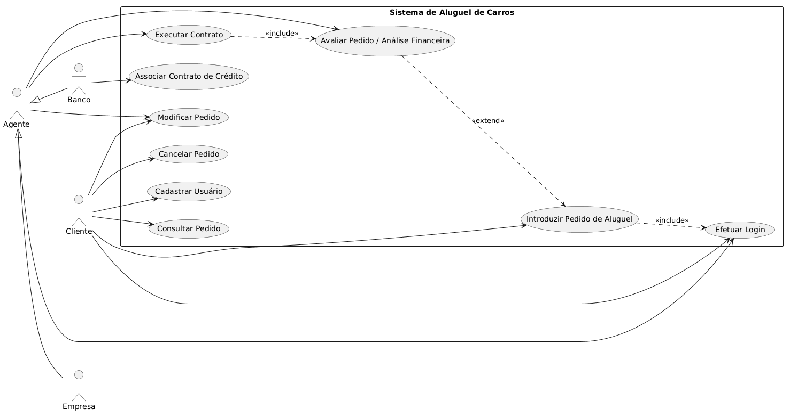

# 🏷️ Sistema de Aluguel de Carros 👨‍💻

O objetivo deste projeto consiste na construcao de um sistema para apoio a gestão de aluguéis de automoveis, permitindo efetuar, cancelar, consultar e modificar pedidos de aluguel pela Internet.


## 📝 Sobre o Projeto
O software propõe o desenvolvimento de um sistema web para controle e gestão de locação de automóveis, oferecendo aos clientes uma interface intuitiva para realizar, cancelar e modificar reservas de forma autônoma. A plataforma centraliza o gerenciamento da frota de veículos, o acompanhamento de contratos e o histórico de locações, garantindo maior eficiência operacional para a empresa e uma experiência ágil e acessível para o usuário final.

## Objetivo

Desenvolver um software em Java utilizando Micronaut, para gerenciar pedidos e contratos de aluguel de carros, incluindo analise financeira por agentes (empresas e bancos) e acompanhamento do ciclo completo do pedido.

## ✨ Funcionalidades Principais

- 🔐 **Autenticação Segura:** Login, Cadastro e Recuperação de Senha.
- 📈 **Gestão de Solicitações de Aluguel:**  Criação, consulta, modificação e cancelamento de pedidos de aluguel..
- 📊 **Avaliação de Solicitações:** Análise financeira, modificação, aprovação/reprovação e execução de contratos por empresas e bancos.
- 👤 **Gestão de Contratantes:** Cadastro de dados pessoais (RG, CPF, Nome, Endereço), profissão, vínculos empregatícios e rendimentos (até 3 entidades).
- 🚗 **Gestão de Automóveis:** Cadastro de veículos com matrícula, ano, marca, modelo e placa, incluindo registro de propriedade conforme tipo de contrato.
- 📄 **Gestão de Contratos:** Criação e acompanhamento de contratos de aluguel, com suporte à associação de contratos de crédito concedidos por bancos agentes.


## Tecnologias Utilizadas

- **Java**: 
- **Micronaut**: 

## Dependencias


## 📂 Estrutura de Pastas
```
/
├── docs/
│   ├── Diagrama-casos-de-uso.png
│   └── uml_classes_pacotes.png
└── README.md
```


## Instalacao e Execucao

### Pre-requisitos


### Passos


## Modelos UML

### Diagrama de Casos de Uso


### Diagrama de Classes e Pacotes


## Integrantes

- Ana Luiza de Freitas Rodrigues
- Felipe Augusto Mendes Pereira
- Francisco Rafael Pereira Rodrigues
- Kayke Emanoel de Souza Santos

## Professor Responsavel

- Joao Paulo Carneiro Aramuni

## Licenca

Definir a licenca oficial do projeto.
